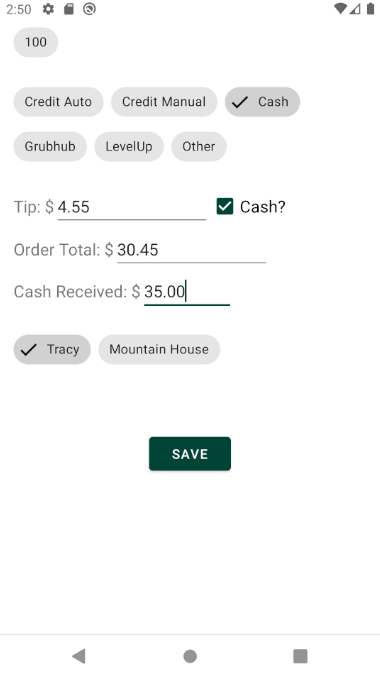
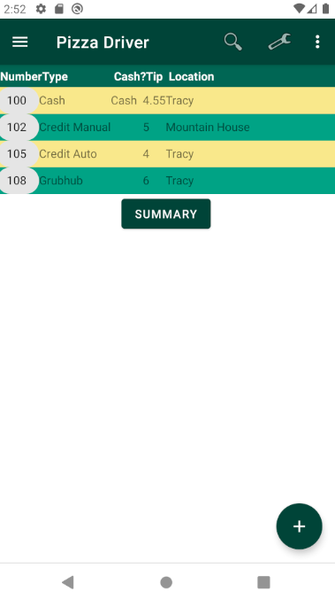
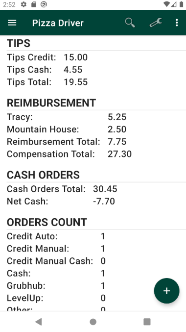

# Continuous integration

# Releases
- stable (1.5.x) - Main Branch
  - Stable release, combination for java and xml files for the UI.
- latest (2.0.x) - In testing 2.0.x Branch
  - In testing, will be designed using Jetpack Compose and Kotlin.

# Screenshots

